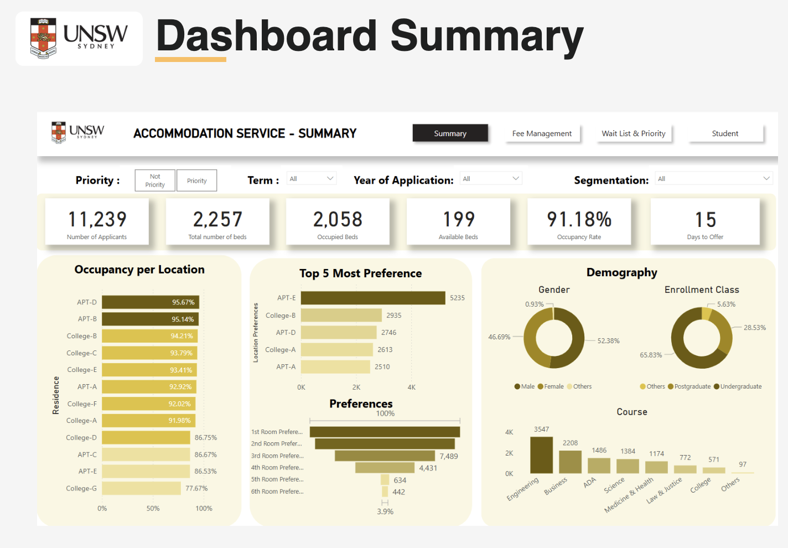
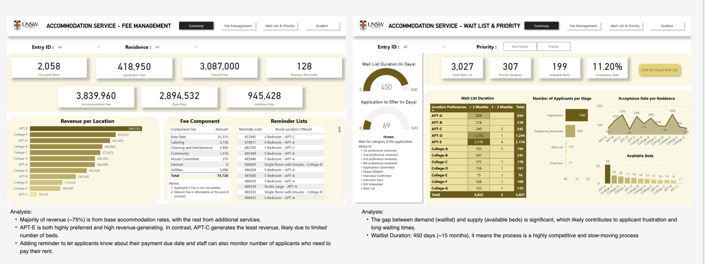
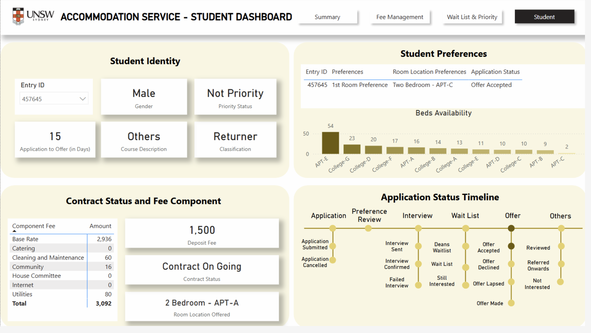

# 🏠 UNSW Student Accommodation Dashboard

A Power BI project analyzing UNSW student accommodation data to uncover insights on application trends, bed availability, revenue distribution, and waitlist dynamics. This project provides actionable recommendations to improve student housing operations.

## 🔧 Tools Used
- Power BI
- SQL
- Excel

## 📊 Project Goals
- Understand trends in application and allocation volumes  
- Visualize occupancy rates, student preferences, and demographics  
- Identify revenue sources and financial efficiency per location  
- Highlight gaps in supply vs. demand using waitlist analysis  
- Track individual application progress through the housing pipeline  

---

## 📸 Dashboards

### 1. 📈 Summary Dashboard
- Shows total applicants, bed availability, occupancy rate, and average wait time.
- Visualizes top 5 location preferences, demographic breakdown, and room preference levels.

---

### 2. 💰 Fee & Waitlist Analysis
- Highlights revenue per location and key cost components.
- Shows waitlist length, acceptance rate, and applicant flow through each stage.
- Identifies high-demand and low-acceptance areas.

---

### 3. 👤 Student-Level Dashboard
- Individual applicant’s housing status, preferences, and contract details.
- Displays component fees, room allocation, and full application status timeline.

---

## 📂 Files Included
- `UNSW_Accommodation.pbix`: The full Power BI report file
- `dashboard1.png`, `dashboard2.png`, `dashboard3.png`: Dashboard screenshots
- `README.md`: This documentation

## 🚀 How to Use
1. Download this repository
2. Open `UNSW_Accommodation.pbix` with [Power BI Desktop](https://powerbi.microsoft.com/en-au/desktop/)
3. Interact with filters and visuals to explore the data

## 👥 Contributors
- Parth Chandan  
- Purba Dutta  
- Akbar Tantu  
- Agnes Makay

## 📌 License
This project is for academic and portfolio purposes only.

